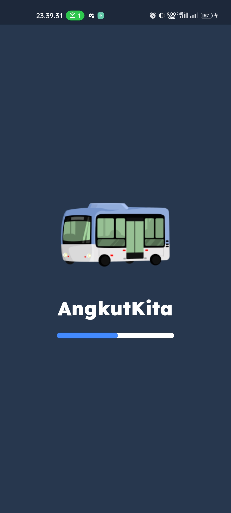
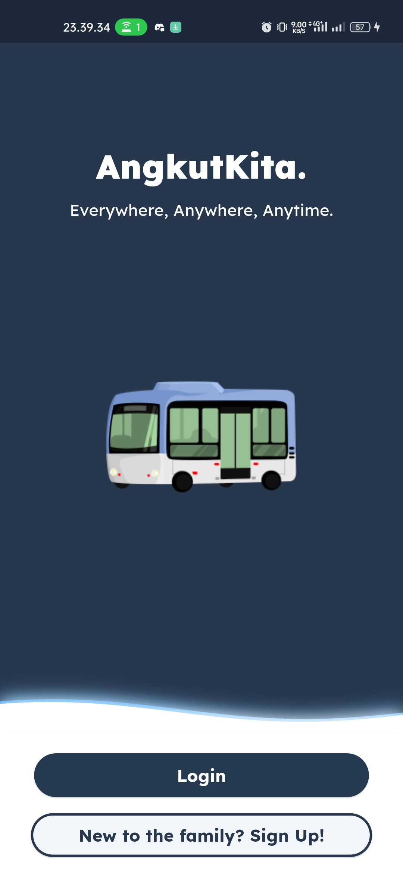
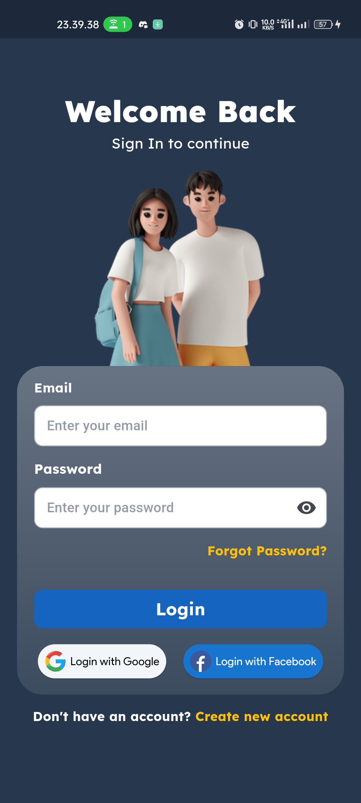
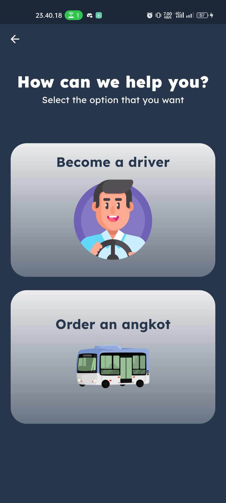
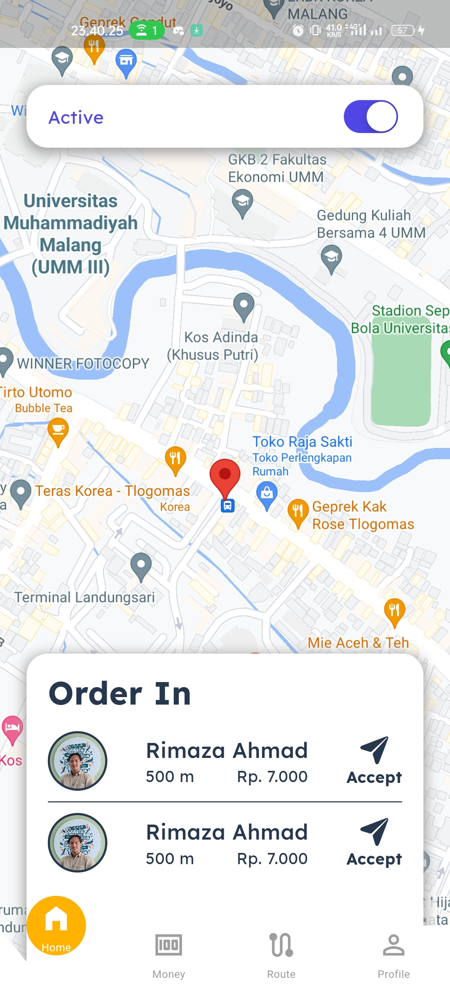
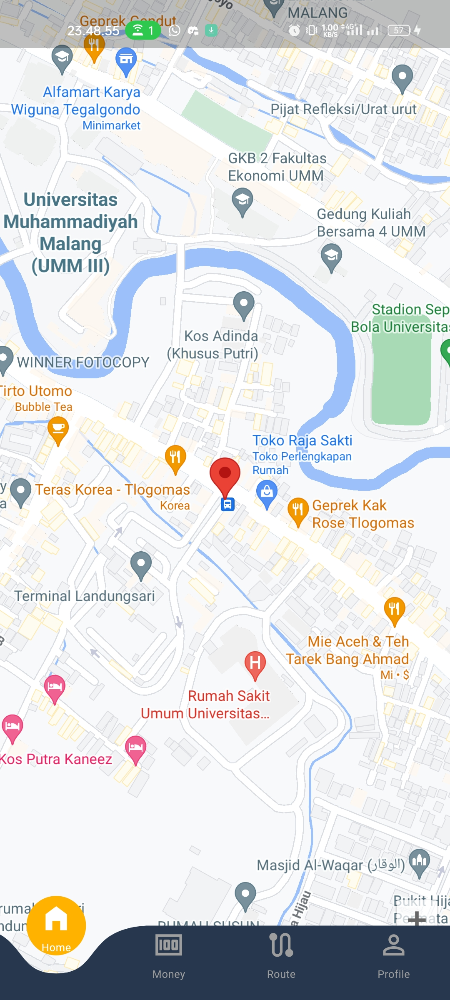
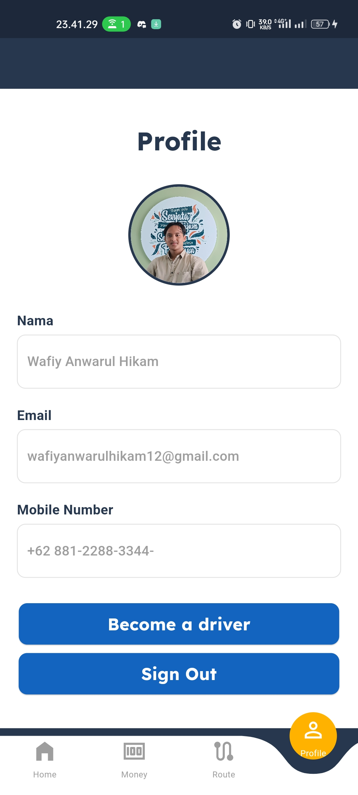

  <h1>Welcome to <a href = ''>Angkut Kita</a></h1>

  
  
  

  

   

  
Angkut Kita is an order angkot application, developed by  Team

  <h4>Made With</h4>
  
  

 

This project developed to face and solve SDGs

  <h3>CodeSprinters</h3>
  <h3>OUR TEAM MEMBER</h3>
    <h4>Hustler: </h4>
  
Alhubul Austad Ramadhan

    <h4>Hipster: </h4>
  
Fairuz Ardhan Haunan  

    <h4>Hipster: </h4>
  

Ridho Aulia Rahman

  
Wafiy Anwarul Hikam

## To trying this app, follow all of the instructions below

<h3>Screenshots of Application</h3>

Landing Page, First Page, Login Page

Register Page, Role Choose Page

Home Page Menu Driver

Home Page Menu User, User Profile Menu

For help getting started with Flutter development, view the
[online documentation](https://docs.flutter.dev/), which offers tutorials,
samples, guidance on mobile development, and a full API reference.
